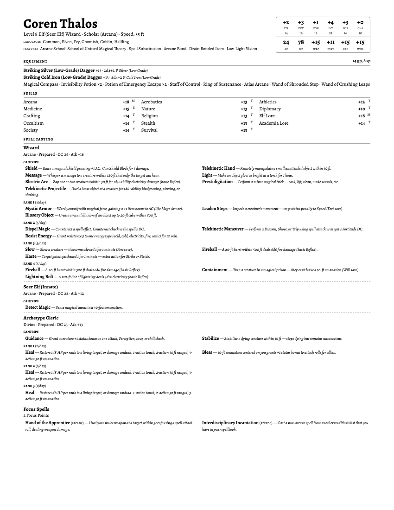

# p2e-character-one-pager

A CLI tool that converts [Pathbuilder 2e](https://pathbuilder2e.com/) character exports into single-page HTML character sheets, optimized for printing and quick table reference.

## Example Output



## Quick Start

The only prerequisite is **Python 3.11+**. The included `run.sh` script handles everything else automatically (virtual environment, dependencies).

```bash
./run.sh character.json
```

That's it. On first run it will create a virtual environment and install dependencies, which takes a few seconds. Subsequent runs start instantly.

The output is a self-contained HTML file (`character_onepager.html`) you can open in any browser or print to PDF.

### Don't have Python 3.11+?

Check your version with `python3 --version`. If you need to install or upgrade:

**macOS (Homebrew):**

```bash
brew install python@3.13
```

**Linux (Ubuntu/Debian):**

```bash
sudo apt update && sudo apt install python3
```

**Any platform (pyenv)** — useful if you need to manage multiple Python versions:

```bash
# Install pyenv
brew install pyenv          # macOS
curl https://pyenv.run | bash  # Linux

# Add to your shell config (~/.zshrc or ~/.bashrc):
export PYENV_ROOT="$HOME/.pyenv"
[[ -d $PYENV_ROOT/bin ]] && export PATH="$PYENV_ROOT/bin:$PATH"
eval "$(pyenv init -)"

# Then install Python and set it for this project
pyenv install 3.13
pyenv local 3.13
```

## Usage

```bash
# Basic usage
./run.sh wizard.json

# Dark theme, A4 paper
./run.sh wizard.json --theme dark --page-size a4

# Force caster layout, show 12 skills
./run.sh wizard.json --profile caster --skills 12

# Custom output path
./run.sh wizard.json -o sheets/my_wizard.html
```

### Options

| Flag | Default | Description |
|------|---------|-------------|
| `-o, --out` | `{name}_onepager.html` | Output file path |
| `--page-size` | `letter` | Page format: `letter` or `a4` |
| `--theme` | `default` | Visual theme: `default` (light) or `dark` |
| `--profile` | `auto` | Layout emphasis: `auto`, `caster`, `martial`, or `hybrid` |
| `--skills` | `8` | Number of skills to display |
| `--include-prepared / --no-include-prepared` | `true` | Show prepared spell lists |
| `--include-known / --no-include-known` | `false` | Show all known/available spells |
| `--font-source` | `google` | Font loading: `google` (Alegreya via Google Fonts) or `none` |
| `--debug` | off | Also output a `.debug.json` with the normalized character model |

### Manual Installation

If you prefer to install the `p2e-character-one-pager` command directly instead of using `run.sh`:

```bash
python3 -m venv .venv
source .venv/bin/activate
pip install -e .
p2e-character-one-pager build character.json
```

## How It Works

1. **Parse** — Reads the Pathbuilder JSON export and normalizes it into a structured character model (ability modifiers, proficiency bonuses, save totals, skill modifiers, spell DCs, weapon attack/damage).

2. **Profile** — Auto-detects whether the character is a caster, martial, or hybrid based on spell counts and weapon stats. This determines which sections appear first in the layout so the most relevant information is "above the fold."

3. **Render** — Feeds the character data into a Jinja2 template with embedded CSS. The output is a single self-contained HTML file with no external dependencies (aside from an optional Google Fonts link).

### Character Profiles

| Profile | Prioritized Sections |
|---------|---------------------|
| Caster | Defense, Skills, Weapons, **Spellcasting**, Focus, Items |
| Martial | Defense, **Weapons**, Skills, Items, Spellcasting, Focus |
| Hybrid | Defense, **Weapons**, Skills, **Spellcasting**, Focus, Items |

## Project Structure

```
p2e_character_one_pager/
├── cli.py          # Click CLI entry point
├── parse.py        # Pathbuilder JSON → CharacterModel
├── model.py        # Pydantic data models
├── profile.py      # Caster/martial/hybrid classification
├── render.py       # Jinja2 template rendering + CSS loading
├── spells.py       # Inline spell description dictionary
├── assets/
│   ├── base.css    # Core layout and typography
│   ├── print.css   # Print media / @page rules
│   └── themes/     # default.css, dark.css
└── templates/
    └── onepager.html.j2
```

## Dependencies

- [pydantic](https://docs.pydantic.dev/) — data validation and serialization
- [Jinja2](https://jinja.palletsprojects.com/) — HTML template rendering
- [Click](https://click.palletsprojects.com/) — CLI framework
